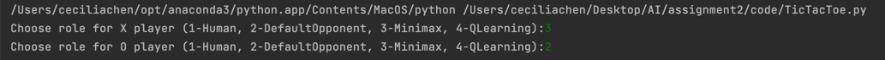
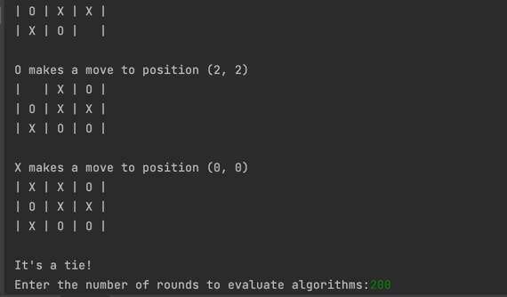
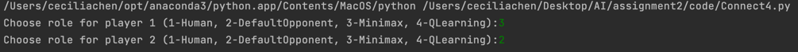
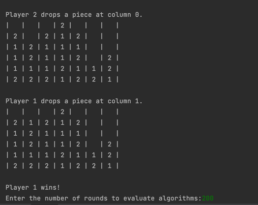

# Tic-Tac-Toe / Connect4
* Human Player  
* Default AI Opponent  
* Minimax AI Player  
* Q-Learning AI Player

### Instructions to run the Tic-Tac-Toe
* Make sure under the root directory of the project
* Run the TicTacToe.py file
* Enter the required parameters in the command line (role for players)

* Press enter, the program will run and show the process of playing.
* Then it would require a new parameter (number of rounds to evaluate algorithms)

### Instructions to run the Connect4
* Make sure under the root directory of the project
* Run the Connect4.py file
* Enter the required parameters in the command line (role for players)

* Press enter, the program will run and show the process of playing.
* Then it would require a new parameter (number of rounds to evaluate algorithms)   

### Link to watch the demo video
https://drive.google.com/drive/folders/1Sb7tSLm269iQQc8uEXVZRcu3NAdHICZX?usp=share_link
